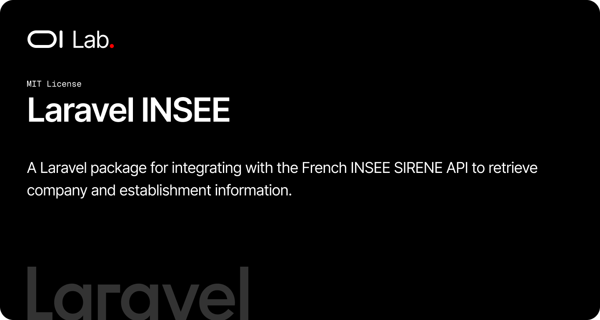

# OI Laravel INSEE

[](https://packagist.org/packages/oi-lab/oi-laravel-insee)
[](https://packagist.org/packages/oi-lab/oi-laravel-insee)
[](https://github.com/oi-lab/oi-laravel-insee/actions)
[](LICENSE)

A Laravel package for integrating with the French INSEE SIRENE API to retrieve company and establishment information.

## Features

- Look up companies by SIREN and establishments by SIRET
- Full-text search over companies (`/siren`) and establishments (`/siret`) with the SIRENE query syntax
- API status endpoint (`/informations`)
- Typed responses via `spatie/laravel-data` DTOs, alongside raw-array methods
- Multicriteria `/siret` search from typed criteria, paginated by cursor, with counts and facets
- A two-window rate limiter (30/min, 2 000/h) shared by every call, quota-header aware, with typed exceptions and retries
- Automatic `dirigeant` extraction for natural persons (entrepreneur individuel, micro-entrepreneur, EIRL)
- Access-token caching for OAuth-based authentication
- `Insee` facade, `insee` container binding, and constructor-injectable `Client`

## Requirements

- PHP 8.2+
- Laravel 11, 12, or 13
- [spatie/laravel-data](https://github.com/spatie/laravel-data) 4.x
- INSEE SIRENE API credentials ([api.insee.fr](https://api.insee.fr/catalogue/))

## Installation

You can install the package via composer:

```bash
composer require oi-lab/oi-laravel-insee
```

## Configuration

Publish the configuration file:

```bash
php artisan vendor:publish --tag=oi-laravel-insee-config
```

Add your INSEE API credentials to your `.env` file:

```env
INSEE_CLIENT_SECRET=your-insee-api-key
INSEE_CLIENT_ID=your-client-id  # Optional, for OAuth authentication
INSEE_BASE_URL=https://api.insee.fr/api-sirene/3.11  # Optional
INSEE_CACHE_DURATION=23  # Optional, in hours
```

You can obtain your API credentials from [INSEE API Portal](https://portail-api.insee.fr/).

## Usage

### Using the Facade

```php
use OiLab\OiLaravelInsee\Facades\Insee;

// Find establishment by SIRET
$establishment = Insee::findSiret('12345678901234');

// Find company by SIREN
$company = Insee::findSiren('123456789');

// Search companies
$companies = Insee::searchCompanies([
    'q' => 'denomination:ACME'
]);

// Search establishments
$establishments = Insee::searchEstablishments([
    'q' => 'denominationUniteLegale:ACME'
]);

// Get API status
$status = Insee::getApiStatus();
```

### Using Dependency Injection

```php
use OiLab\OiLaravelInsee\Client;

class CompanyController extends Controller
{
    public function __construct(private Client $insee)
    {
    }

    public function show(string $siret)
    {
        $establishment = $this->insee->findSiret($siret);

        return view('company.show', compact('establishment'));
    }
}
```

### Using the Helper

```php
$client = app('insee');
$result = $client->findSiret('12345678901234');
```

## Available Methods

### `findSiret(string $siret): array`

Retrieve information about an establishment using its SIRET number (14 digits).

```php
$establishment = Insee::findSiret('12345678901234');
```

### `findSiren(string $siren): array`

Retrieve information about a company using its SIREN number (9 digits).

```php
$company = Insee::findSiren('123456789');
```

### `searchCompanies(array $params): array`

Search for companies using query parameters.

```php
$companies = Insee::searchCompanies([
    'q' => 'denomination:ACME AND categorieJuridiqueUniteLegale:5499',
    'nombre' => 20,
    'debut' => 0
]);
```

Common search parameters:
- `q`: Search query (use field:value format)
- `nombre`: Number of results (default: 20, max: 1000)
- `debut`: Starting position for pagination

### `searchEstablishments(array $params): array`

Search for establishments using query parameters.

```php
$establishments = Insee::searchEstablishments([
    'q' => 'denominationUniteLegale:ACME AND codePostalEtablissement:75001',
    'nombre' => 20
]);
```

### `getApiStatus(): array`

Get the current status of the INSEE API.

```php
$status = Insee::getApiStatus();
```

## Search Query Syntax

The INSEE API uses a specific query syntax for searches:

```php
// Single field search
'q' => 'denomination:ACME'

// Multiple criteria with AND
'q' => 'denomination:ACME AND codePostalEtablissement:75001'

// Multiple criteria with OR
'q' => 'codePostalEtablissement:75001 OR codePostalEtablissement:75002'

// Wildcard search
'q' => 'denomination:ACM*'
```

### Common Search Fields

**For companies (SIREN):**
- `siren`: SIREN number
- `denomination`: Company name
- `categorieJuridiqueUniteLegale`: Legal category
- `activitePrincipaleUniteLegale`: Main activity code (NAF/APE)

**For establishments (SIRET):**
- `siret`: SIRET number
- `denominationUniteLegale`: Company name of the legal unit
- `codePostalEtablissement`: Postal code
- `activitePrincipaleEtablissement`: Main activity code
- `etatAdministratifEtablissement`: Administrative status (A=active, F=closed)

## Response Format

All methods return arrays containing the API response. Successful responses include:

```php
[
    'header' => [
        'statut' => 200,
        'message' => 'OK'
    ],
    'etablissement' => [...], // for findSiret
    'uniteLegale' => [...],   // for findSiren
    // or
    'etablissements' => [...], // for searchEstablishments
    'unitesLegales' => [...]   // for searchCompanies
]
```

### Dirigeant (Natural Persons Only)

For natural persons (entrepreneur individuel, micro-entrepreneur, EIRL), the package automatically injects a `dirigeant` key into every `uniteLegale` node of the response:

```php
$result = Insee::findSiren('123456789');

$result['uniteLegale']['dirigeant'];
// [
//     'nom'      => 'DUPONT',  // nomUniteLegale (birth name)
//     'nomUsage' => 'MARTIN',  // nomUsageUniteLegale (married/usage name, may be null)
//     'prenom'   => 'Jean',    // prenomUsuelUniteLegale, falls back to prenom1UniteLegale
//     'sexe'     => 'M',       // 'M' or 'F'
// ]
```

The `dirigeant` key is injected at the same locations across all endpoints:

- `findSiret`  → `etablissement.uniteLegale.dirigeant`
- `findSiren`  → `uniteLegale.dirigeant`
- `searchCompanies`        → `unitesLegales[].dirigeant`
- `searchEstablishments`   → `etablissements[].uniteLegale.dirigeant`

**Important limitation:** the INSEE Sirene API does not expose director information for legal entities (SAS, SARL, SCI, associations…). For those, the `dirigeant` key is **not** injected — the original response is returned unchanged. To retrieve directors of legal entities, you need a complementary source such as the [Recherche d'entreprises API](https://recherche-entreprises.api.gouv.fr/) (which aggregates INPI/RNE data).

## Typed Responses (DTO)

In addition to the array-returning methods, the package exposes typed
[`spatie/laravel-data`](https://spatie.be/docs/laravel-data) DTOs. Each typed
method mirrors its array counterpart but returns a strongly-typed object with IDE
autocompletion, so you no longer have to remember the INSEE field names or guess
which keys are present.

```php
use OiLab\OiLaravelInsee\Facades\Insee;

$response = Insee::siret('12345678901234');        // OiLab\OiLaravelInsee\Data\SiretResponse
$response->header->statut;                          // 200
$response->etablissement->siret;                    // '12345678901234'
$response->etablissement->adresseEtablissement->codePostalEtablissement;
$response->etablissement->uniteLegale->denominationUniteLegale;

$company = Insee::siren('123456789');              // SirenResponse
$company->uniteLegale->dirigeant?->nom;             // Dirigeant DTO, or null for a legal entity

$companies = Insee::companies(['q' => 'denomination:ACME']);       // SirenSearchResponse
$companies->header->total;
foreach ($companies->unitesLegales as $unite) {     // UniteLegale[]
    $unite->siren;
}

$establishments = Insee::establishments(['q' => 'codePostalEtablissement:75001']); // SiretSearchResponse
foreach ($establishments->etablissements as $etablissement) {                       // Etablissement[]
    $etablissement->siret;
}
```

| Typed method                     | Returns                | Array counterpart        |
|----------------------------------|------------------------|--------------------------|
| `siret(string $siret)`           | `SiretResponse`        | `findSiret()`            |
| `siren(string $siren)`           | `SirenResponse`        | `findSiren()`            |
| `companies(array $params)`       | `SirenSearchResponse`  | `searchCompanies()`      |
| `establishments(array $params)`  | `SiretSearchResponse`  | `searchEstablishments()` |

All DTOs live in the `OiLab\OiLaravelInsee\Data` namespace
(`SiretResponse`, `SirenResponse`, `SirenSearchResponse`, `SiretSearchResponse`,
`Etablissement`, `UniteLegale`, `AdresseEtablissement`, `PeriodeUniteLegale`,
`PeriodeEtablissement`, `Dirigeant`, `ResponseHeader`). Fields are nullable so
partial INSEE responses never throw, and being `spatie/laravel-data` objects they
serialize back to arrays/JSON with `->toArray()` / `->toJson()`. The `dirigeant`
node is exposed as a `Dirigeant` DTO (or `null` for legal entities), following the
same rules as the array API above.

## Multicriteria Search (cursor-paginated)

`SiretSearchCriteria` builds the `q` parameter from typed criteria, so no Sirene syntax leaks into your code. Every filter is on **codes**, never on labels; the zone filters (communes, postal codes, departments) are alternatives of one another.

```php
use OiLab\OiLaravelInsee\Enums\WorkforceRange;
use OiLab\OiLaravelInsee\Facades\Insee;
use OiLab\OiLaravelInsee\Search\SiretSearchCriteria;

$criteria = SiretSearchCriteria::make()
    ->headquartersOnly()                                   // etablissementSiege:true
    ->activeOnly()                                         // current period of etatAdministratifEtablissement:A
    ->publicDiffusionOnly()                                // statutDiffusionEtablissement:O
    ->workforceRanges(WorkforceRange::within(20, 249))     // 12, 21, 22, 31
    ->departmentCodes(['34'])                              // prefix of the commune code (34*)
    ->communeCodes(['31555'])                              // exact commune codes
    ->postalCodes(['75001'])
    ->nafCodes(['62.01Z'])                                 // optional
    ->fields(['siret', 'siren', 'denominationUniteLegale', 'trancheEffectifsUniteLegale']);

$criteria->toQuery();   // the q parameter

Insee::countEstablishments($criteria);                                  // int, nombre=0
Insee::countEstablishmentsBy($criteria, 'trancheEffectifsUniteLegale'); // ['12' => 1476, '21' => 583, ...]

foreach (Insee::searchEstablishmentsLazily($criteria, cursor: $savedCursor, pageSize: 1000) as $page) {
    foreach ($page->etablissements as $etablissement) { /* ... */ }

    $savedCursor = $page->nextCursor;   // persist it to resume the search later
}
```

- Pages are `SiretSearchPage` (`etablissements`, `cursor`, `nextCursor`, `total`, `isLast()`). The search starts at `curseur=*` and stops when `curseurSuivant` equals `curseur`.
- No result is an empty page (and a count of `0`), not an exception. A search without any criterion is refused.
- Queries are sent as a `POST` (`application/x-www-form-urlencoded`) once the URL of a `GET` would exceed `post_threshold` characters (2 000 by default). More than 1 000 alternatives are grouped in parenthesised chunks of at most 1 000.
- `fields()` maps to `champs`, `masquerValeursNulles=true` and `Accept-Encoding: gzip` lighten the responses.
- `Insee::establishmentOrFail($siret)` returns the `Etablissement`, or `null` when the INSEE does not know it, and throws the typed exceptions below. Unlike the searches it can use the whole hourly quota.

### Workforce ranges

`WorkforceRange` lists the INSEE codes (`NN`, `00`, `01`, `02`, `03`, `11`, `12`, `21`, `22`, `31`, `32`, `41`, `42`, `51`, `52`, `53`) with `min()`, `max()` and `label()`; `WorkforceRange::within(?int $min, ?int $max)` returns the ranges entirely inside a headcount interval (an INSEE range cannot split 250: `32` is 250 to 499).

## Rate Limiting and Typed Exceptions

The API allows **30 calls per minute and 2 000 per hour** (the INSEE may change them). One limiter, kept in the cache store (Redis in production) and shared by **every** call of the package, enforces both windows; the quota headers of each response (`x-quota-*`, `x-rate-limit-*`) keep it in line with the real remainder.

| Calls | Minute window full | Hourly quota exhausted |
|-------|--------------------|------------------------|
| `searchEstablishmentsLazily()`, `countEstablishments()`, `countEstablishmentsBy()` (background) | waits (up to `rate_limits.max_wait_seconds`) | throws `InseeQuotaExceededException`, from `rate_limits.background_ceiling` (1 600/2 000) |
| `establishmentOrFail()` (unit) | waits | throws `InseeQuotaExceededException` at the real end of the quota |
| `findSiret()`, `findSiren()`, `searchEstablishments()`... (historical) | waits `legacy_max_wait_seconds` at most, then calls anyway | returns an INSEE-shaped array `['header' => ['statut' => 429, 'message' => ...]]` |

The historical methods never throw, never retry and keep returning the error body as an array; the typed methods throw, all under `OiLab\OiLaravelInsee\Exceptions\InseeException` (`statusCode`):

- `InseeQuotaExceededException` (429 or exhausted budget): `retryAt` is the date to come back (reset of the hour, else of the minute).
- `InseeUnavailableException`: 5xx, maintenance or network error, after the retries (1 s, 3 s, 9 s by default). 4xx are never retried.
- `InseeRequestException`: the API rejected the request (400 bad `q`, 401, 403...), with the INSEE message.

```php
try {
    $etablissement = Insee::establishmentOrFail($siret);
} catch (InseeQuotaExceededException $e) {
    $this->release($e->retryAt->diffInSeconds());   // postpone, nothing is lost
} catch (InseeUnavailableException $e) {
    // retry later
}
```

## Notes on the API

Checked against the real Sirene 3.11 API on 7 October 2026:

- **Quota headers**: `x-quota-limit`, `x-quota-remaining`, `x-quota-reset` (hour) and `x-rate-limit-limit`, `x-rate-limit-remaining`, `x-rate-limit-reset` (minute). Both `reset` values are epoch timestamps in **milliseconds**. The hourly window starts at the first call of the hour.
- **Authentication**: `X-INSEE-Api-Key-Integration` works; `Authorization: Bearer <key>` is refused (401). The package keeps the former.
- **Historised variables**: `etatAdministratifEtablissement` cannot be searched without `periode(...)` (400 "Erreur de syntaxe dans le paramètre q"), and `periode(etatAdministratifEtablissement:A)` alone also matches past periods. The **current** period is `periode(etatAdministratifEtablissement:A AND -dateFin:*)`, which is what `activeOnly()` sends; `nafCodes()` uses the same form on `activitePrincipaleEtablissement`.
- **Departments**: the wildcard works on the commune code (`codeCommuneEtablissement:34*`, `2A*`, `971*`), so `departmentCodes()` is supported.
- **Legal-unit variables** such as `trancheEffectifsUniteLegale` are searchable from `/siret`: no second call on `/siren`.
- **No result** is an HTTP 404 with `header.statut: 404`; an unknown or invalid key is a 401 with `{"message": "Unauthorized"}`.
- **Facets**: `facette.champ` with `nombre=0` answers `facettes[].comptages[]` (`valeur`, `nombre`).
- A `POST` with `application/x-www-form-urlencoded`, gzip, `champs` and `masquerValeursNulles=true` are accepted, as are 1 000+ alternatives in one query (the package still groups them by 1 000, as the documentation requires).

## AI Assistant Skills

The package ships an AI context skill describing how to use it (SIREN/SIRET lookups, the `Insee` facade and `Client`, search syntax, and `dirigeant` injection). Install it with the unified `oi:skills` command, provided by the `oi-lab/oi-laravel-development` package, which discovers and installs the skills shipped by every installed `oi-lab/*` package:

```bash
php artisan oi:skills
```

To install only this package's skill non-interactively:

```bash
php artisan oi:skills oilab-laravel-insee --project   # or --global
```

This copies the skill to `.claude/skills/oilab-laravel-insee/` and `.junie/skills/oilab-laravel-insee/`, and adds an `=== oi-lab/oi-laravel-insee rules ===` section to your `CLAUDE.md`. The package-local `php artisan oi-insee:install-ai-skill` command is still available but **deprecated** in favor of `oi:skills`. See [docs/advanced/skills.md](docs/advanced/skills.md).

## Testing

```bash
composer test
```

## Contributing

Contributions are welcome! Please feel free to submit a Pull Request.

When contributing:
1. Write tests for new features
2. Ensure all tests pass: `vendor/bin/pest`
3. Follow existing code style
4. Update documentation as needed

## License

This package is open-source software licensed under the [MIT license](LICENSE).

## Credits

**[Olivier Lacombe](https://www.olacombe.com)** - Creator and maintainer

Olivier is a Product & Technology Director based in Montpellier, France, with over 20 years of experience innovating in UX/UI and emerging technologies. He specializes in guiding enterprises toward cutting-edge digital solutions, combining user-centered design with continuous optimization and artificial intelligence integration.

**Projects & Resources:**
- [OI Dev Docs](https://dev.olacombe.com) - Documentation for all Open Source OI Lab packages
- [OnAI](https://onai.olacombe.com) - Training courses and masterclasses on generative AI for businesses
- [Promptr](https://promptr.olacombe.com) - Prompt engineering Management Platform

## Support

For support, please open an issue on the [GitHub repository](https://github.com/oi-lab/oi-laravel-insee/issues).
